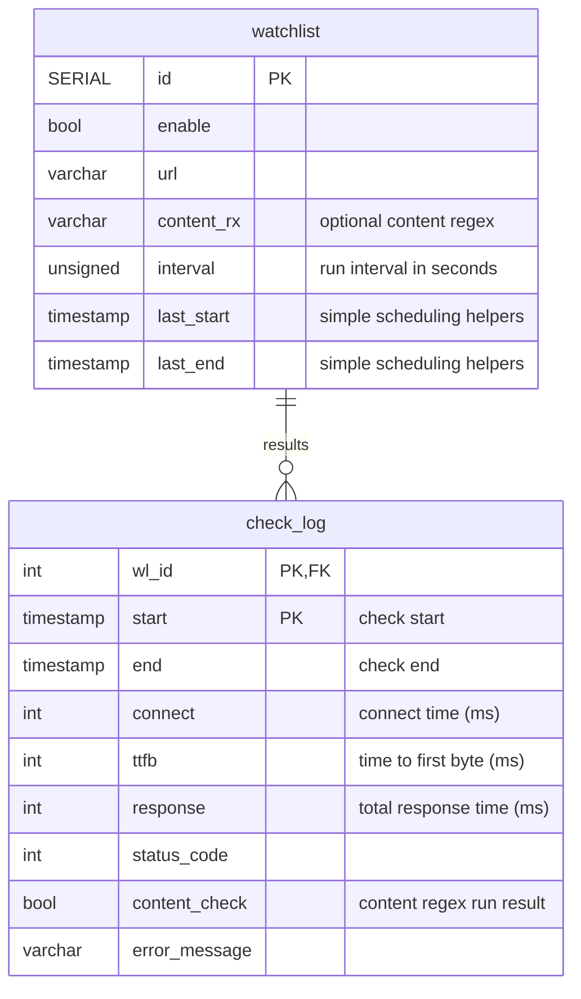

# PythonSWE-13.03.2024-dmig
A simple site availability monitor

## Limitations
- Server response always loaded in memory -- may cause problems with large responses
  - this might be handled by using HEAD requests, when content check is not needed (unreliable though)
  - response can be streamed to temp file for use with external tool like `ripgrep` for regex checking
- Results are written to DB 1-by-1, by worker coroutine
  - implementing result queue and watcher coroutine/thead to save results in bulk would increase throughput as well as complexity

## Configuration
A single configuration file is used: [settings.toml](settings.toml)
- `db` section is used for database connection:
  - `cafile` - should be a path to root CA certificate file
  - see the [create_pool() reference](https://magicstack.github.io/asyncpg/current/api/index.html#connection-pools) for other available options
- `timeouts` -- to specify HTTP request timeouts
  - `readwrite` -- read and write timeout, seconds
  - `connection` -- connection timeout, seconds
- `scheduler`
  - `max_concurrency` -- maximal number of concurrent requests; if higher than `db.max_size`, may cause performance drop
  - `interval` -- in seconds, defines scheduler tick interval as well as minimal execution period

## DB structure

