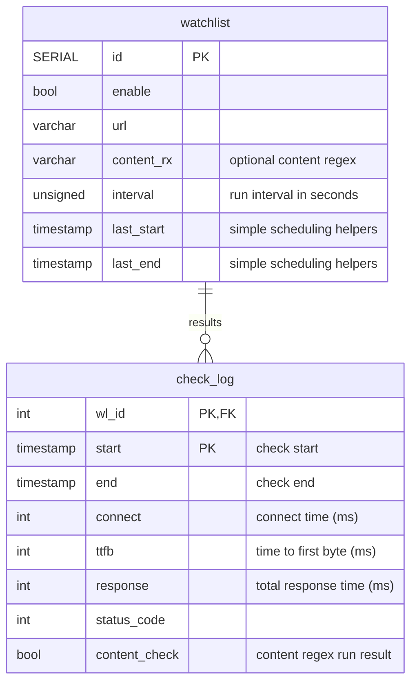

# PythonSWE-13.03.2024-dmig
# A simple site availability monitor

# DB structure

```mermaid
erDiagram
    watchlist {
        SERIAL id PK
        bool enable
        varchar url
        varchar content_rx "optional content regex"
        unsigned interval "run interval in seconds"
        timestamp last_start "simple scheduling helpers"
        timestamp last_end "simple scheduling helpers"
    }
    check_log {
        int wl_id PK, FK
        timestamp start PK "check start"
        timestamp end "check end"
        int connect "connect time (ms)"
        int ttfb "time to first byte (ms)"
        int response "total response time (ms)"
        int status_code
        bool content_check "content regex run result"
    }
    watchlist ||--o{ check_log : results
```
