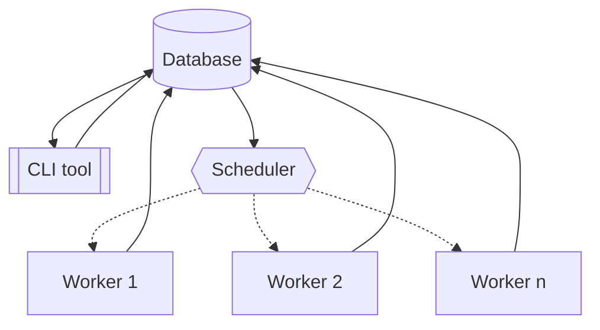
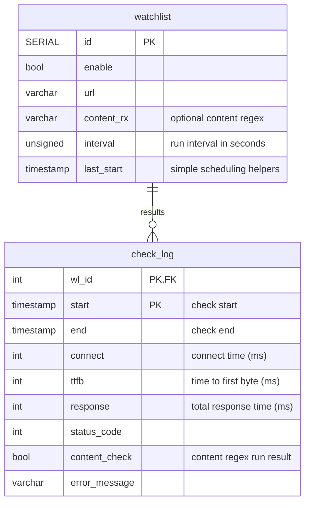

# PythonSWE-13.03.2024-dmig
A simple site availability monitor

## Installation
### Manual
- checkout project code to some path (e.g. `/home/user/url_checker`)
- create and activate virtualenv `python3 -m venv .venv && source .venv/bin/activate`
- install dependendencies `pip install -r requirements.txt`
- run `service.py`
For systemd management:
- edit included `url-checker.service` file: on line `ExecStart=/path/to/project/.venv/bin/python3 /path/to/project/service.py` replace `/path/to/project/` with a real path (e.g. `/home/user/url_checker`)
### Using Docker
- Build a container `docker build -t url-checker .`
- Run it `docker run url-checker`

## CLI
Usage: `cli.py` _action_
Actions:
- `list` -- show list of all scheduled urls and their parameters
- `show` -- show details for single url, parameter:
  - `id` -- record id
- `add`  -- add new url to watch list, parameters:
  - `url`
  - `interval`
  - `content_rx`
- `remove` -- remove url from watch list and all it's log records, parameter:
  - `id` -- record id
- `update` -- modify url parameters:
  - `-e` -- enable checking
  - `-d` -- disable checking
  - `-r regex` -- update content regex to new value
  - `-R` -- remove content regex
  - `-i value` -- update interval

## Limitations & what could be better
- Server response always loaded in memory -- may cause problems with large responses
  - this might be handled by using HEAD requests, when content check is not needed (unreliable though -- not all servers correctly handle them)
  - response can be streamed to a temp file for use with external tool like `ripgrep` for regex checking
- Results are written to DB 1-by-1, by worker coroutine
  - implementing result queue and watcher coroutine/thead to save results in bulk would increase throughput as well as complexity
- _Time To First Byte_ is not precise and may be less than actual, due to the way `*.receive_response_headers.started` events in `httpcore` imlpemented
- `check_log` DB table is created as a plain table without partitions -- no use for them in this demonstration, but for production usage it's better to have partitioning by month over `start` field. This also implies necessity of partition maintanance:
  - by adding and configuring [pg_partman](https://github.com/pgpartman/pg_partman) extension
  - or some trigger function for automatic partition creation
  - or at least some cron job

## Configuration
A single configuration file is used: [settings.toml](settings.toml)
- `db` section is used for database connection:
  - `cafile` - should be a path to root CA certificate file
  - see the [create_pool() reference](https://magicstack.github.io/asyncpg/current/api/index.html#connection-pools) for other available options
- `timeouts` -- to specify HTTP request timeouts
  - `readwrite` -- read and write timeout, seconds
  - `connection` -- connection timeout, seconds
- `scheduler`
  - `max_concurrency` -- maximal number of concurrent requests; if higher than `db.max_size`, may cause performance drop
  - `interval` -- in seconds, defines scheduler tick interval as well as minimal execution period

## Application structure

## DB structure

